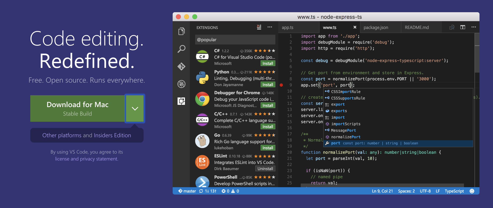

プログラミングを勉強するためには環境構築が必要です。Python も環境構築は最低限必要です。

## 必要なもの

- パソコン
- やる気？

物理的にはパソコンが必要です。個人的には Mac を進めます。私は Windows 系のパソコンには苦手です。（特に日本製）

### パソコン

最近発売されているパソコン何でも可能です。私はデスクトップよりはノートパソコンを勧めます。ノートパソコンは性能もそこそこいいものが多いし運びやすい利点があります。

2019 年度の基準で紹介します。
予算に合わせて準備した方がいいかと思いますが場合よっては中古もいいと思います。

#### Apple

##### MacBook

予算：15 万円 〜 20 万円

軽くてデザインもいいし OS は Unix で作られているのでコマンドが Linux と同じようなものが多いです。最近では Mac で開発するのが定番でしょう。

##### MacBook Air

予算 14 万円 〜 22 万円

私の場合 MacBook Air を初めて使いましたが当時（2011 年）ノートパソコンとしてはとてもいいものです。 MacBook よりは低予算で購入することも可能です。とくに指紋認識はとても便利です。

##### MacBook Pro

予算 16 万円 ~ 32 万円

Pro の方は専門的な使い方をするために購入するものです。個人的には勧めますがある程度スペックをあげるととても高くなるので勉強用ではないと思います。

#### Windows

##### Surface Pro

予算 13 万円から

個人的には WindowsOS のパソコンを購入すると思ったら Surface Pro を買います。別のメーカーより Microsoft 社が作ったものをその Microsoft 社が作った製品なのでサーポートもいいしマシンの相性もいいと思います。Surface Pro はキーボードを外すことによってターブレットとして使用も可能です。また、とても軽いです。

##### Surface Laptop

予算 14 万円から

Surface Pro のキーボードが気に食わない場合はこちらもいい製品です。

#### ThinkPad

予算 9 万円から

ThinkPad ファンからの勧めで載せます私自身は Windows 系は好きではないのでイメージはパス、予算は軽めです。

購入する方法。

Apple や Microsoft は分割で払うことが可能です。パソコンの受命を考えたら 24 ヶ月分割払いがいいかと思います。高い商品でも分割で払えば毎月１万円程度で済みます。

**購入するときの注意点**

- 量販店で買うこと（ポイントが貯まります。）
- 絶対触ってみること（テキストエディタで色糸買いてみる）
  - 自分に合わないものはとてもいいものでも不便で重たい機械にすぎません。
  -

私は MacBook Pro 15' フルスペック -SSD 512 で購入しました。

## Software

必要な Software は色々ありますが簡単に説明すると

- エディター（Editor)
- 実行環境
- コンパイラ

### Editor

エディターも色々ありますが最近は[Visual Studio Code](https://code.visualstudio.com/)を利用することが多いです。私はこれしか使いません。Java をこディングする時は[IntelliJ IDEA](https://www.jetbrains.com/idea/)を使うときもありますが Java は最近使いませんのでいらないです。Python 版の[PyCharm](https://www.jetbrains.com/pycharm/?fromMenu)ということもありますが、有償版です。無料版もありますが機能が少ないし実業務に使うと無料版は使いにくいと感じます。

#### Visual Studio Code Install

[公式サイト](https://code.visualstudio.com/)に入ると以下のようなイメージが見えます。私は Mac から入ったので**Download for Mac**というボタンが表示されています。

## 実行環境（開発環境）

実行環境はこれから我々が作成する Python コードを動かせるものです。中にはコンパイラ（人間が作成したコードをコンピューターが読めるように変更するもの）私たちは最低限 Python が必要です。
