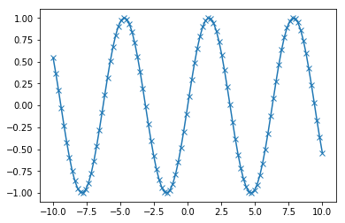

- [scikit-learn](#scikit-learn)
  - [NumPy](#numpy)
  - [SciPy](#scipy)
  - [matplotlib](#matplotlib)
  - [pandas](#pandas)

# scikit-learn

**Introduction**

scikit-learn を勉強するためには以下のようなパッケージをインストールする必要があります。

numpy scipy matplotlib ipython scikit-learn pandas pillow

Install コマンドは以下のようです。

`$pip install numpy scipy matplotlib ipython scikit-learn pandas pillow`

jupyter の ipynb の上で実行するときは以下のようです。

```ipynb
!pip install numpy scipy matplotlib ipython scikit-learn pandas pillow
```

このブログでは scikit-learn で利用する Python のパッケージを触ってみます。

- NumPy
- SciPy
- matplotlib
- pandas
- mglearn

## NumPy

NumPy は、Python で科学技術計算をする際の基本的なツールの 1 つです。（1 つです！）

多次元配列機能や、線形代数やフーリエ変換、擬似乱数生成器などの、高レベルの数学関数が用意されています。

```python
import numpy as np

x = np.array([[1, 2, 3], [4, 5, 6]])
print(x)
```

    [[1 2 3]
     [4 5 6]]

## SciPy

SciPy は、Python で科学技術計算を行うための関数を集めたものです。

高度な線形代数ルーチンや、数学関数の最適化、信号処理、特殊な数学関数、統計分布などの機能を持っています。

scikit-learn は、アルゴリズムを実装する際に SciPy の関数群を利用しています。これから Deep learning を勉強する上でとても重要な SciPy の要素は

scipy.sparse です。scipy.sparse は疎行列を表現するものです。

```python
from scipy import sparse

eye = np.eye(4)
print(eye)
```

    [[1. 0. 0. 0.]
     [0. 1. 0. 0.]
     [0. 0. 1. 0.]
     [0. 0. 0. 1.]]

**COO 形式**

多くの場合、疎なデータを密なデータ構造で作ることはできないようです。そして、疎なデータ表現を直接作る必要があります。

上のコードと同じ疎行列を COO 形式で作ってまます。

```python
data = np.ones(4)
row_indices = np.arange(4)
col_indices = np.arange(4)
print("row indices : {}".format(row_indices))
print("row indices : {}".format(col_indices))

eye_coo = sparse.coo_matrix((data, (row_indices, col_indices)))
print("COO representation: \n{}".format(eye_coo))
```

    row indices : [0 1 2 3]
    row indices : [0 1 2 3]
    COO representation:
      (0, 0)	1.0
      (1, 1)	1.0
      (2, 2)	1.0
      (3, 3)	1.0

## matplotlib

matplotlib は、最も広く使われている Python の科学技術計算向けのグラフ描画ライブラリです。

とても良い品質のデータ可視化を実現する関数群を提供します。 折れ線グラフ、ヒストグラム、散布図など様々な可視化方法がサポートされています。

データや解析結果を様々な視点から可視化することができます。重要な洞察が得られます。

```python
%matplotlib inline
import matplotlib.pyplot as plt
```

**linspace**

-10 から 10 までを 100 ステップに区切った列を配列として生成

```python
x = np.linspace(-10, 10, 100)
print(x)
```

    [-10.          -9.7979798   -9.5959596   -9.39393939  -9.19191919
      -8.98989899  -8.78787879  -8.58585859  -8.38383838  -8.18181818
      -7.97979798  -7.77777778  -7.57575758  -7.37373737  -7.17171717
      -6.96969697  -6.76767677  -6.56565657  -6.36363636  -6.16161616
      -5.95959596  -5.75757576  -5.55555556  -5.35353535  -5.15151515
      -4.94949495  -4.74747475  -4.54545455  -4.34343434  -4.14141414
      -3.93939394  -3.73737374  -3.53535354  -3.33333333  -3.13131313
      -2.92929293  -2.72727273  -2.52525253  -2.32323232  -2.12121212
      -1.91919192  -1.71717172  -1.51515152  -1.31313131  -1.11111111
      -0.90909091  -0.70707071  -0.50505051  -0.3030303   -0.1010101
       0.1010101    0.3030303    0.50505051   0.70707071   0.90909091
       1.11111111   1.31313131   1.51515152   1.71717172   1.91919192
       2.12121212   2.32323232   2.52525253   2.72727273   2.92929293
       3.13131313   3.33333333   3.53535354   3.73737374   3.93939394
       4.14141414   4.34343434   4.54545455   4.74747475   4.94949495
       5.15151515   5.35353535   5.55555556   5.75757576   5.95959596
       6.16161616   6.36363636   6.56565657   6.76767677   6.96969697
       7.17171717   7.37373737   7.57575758   7.77777778   7.97979798
       8.18181818   8.38383838   8.58585859   8.78787879   8.98989899
       9.19191919   9.39393939   9.5959596    9.7979798   10.        ]

**sin**

サイン関数を用いて 2 つ目の配列を生成

```python
y = np.sin(x)
print(y)
```

    [ 0.54402111  0.36459873  0.17034683 -0.03083368 -0.23076008 -0.42130064
     -0.59470541 -0.74392141 -0.86287948 -0.94674118 -0.99209556 -0.99709789
     -0.96154471 -0.8868821  -0.77614685 -0.63384295 -0.46575841 -0.27872982
     -0.0803643   0.12126992  0.31797166  0.50174037  0.66510151  0.80141062
      0.90512352  0.97202182  0.99938456  0.98609877  0.93270486  0.84137452
      0.7158225   0.56115544  0.38366419  0.19056796 -0.01027934 -0.21070855
     -0.40256749 -0.57805259 -0.73002623 -0.85230712 -0.93992165 -0.98930624
     -0.99845223 -0.96698762 -0.8961922  -0.78894546 -0.64960951 -0.48385164
     -0.2984138  -0.10083842  0.10083842  0.2984138   0.48385164  0.64960951
      0.78894546  0.8961922   0.96698762  0.99845223  0.98930624  0.93992165
      0.85230712  0.73002623  0.57805259  0.40256749  0.21070855  0.01027934
     -0.19056796 -0.38366419 -0.56115544 -0.7158225  -0.84137452 -0.93270486
     -0.98609877 -0.99938456 -0.97202182 -0.90512352 -0.80141062 -0.66510151
     -0.50174037 -0.31797166 -0.12126992  0.0803643   0.27872982  0.46575841
      0.63384295  0.77614685  0.8868821   0.96154471  0.99709789  0.99209556
      0.94674118  0.86287948  0.74392141  0.59470541  0.42130064  0.23076008
      0.03083368 -0.17034683 -0.36459873 -0.54402111]

matplotlib の plot 関数は、一方の配列に対して他方の配列のプロットします。

```python
plt.plot(x, y, marker="x")
```

    [<matplotlib.lines.Line2D at 0x1120d3198>]



## pandas

pandas は、データを変換したり解析したりするためのライブラリです。pandas は R の DataFrame を模して作られたようです。（まじで？）

DataFrame というデータ構造を中心に構成されています。簡単に、pandas は、テーブルのようなもので、エクセルのスプレットシートに似ているよう？

pandas は、このテーブルを変更する関数や操作する様々な方法を提供しています。テーブルに対して SQL のような Query 文を発行することが可能です。

NumPy の配列は全て要素が同じ型でなければならないが、pandas の DataFrame では列ごとに異なる型であっても良い。

pandas の有用な機能もう一つはデータベースや、Excel、CSV などからデータを取り込むことが可能です。（いいね！）

```python
import pandas as pd
from IPython import display
data = {
        'Name' : ["Joho", "Anna", "Pater", "Linda"],
        'Location': ["New York", "Paris", "Berlin", "London"],
        'Age': [24, 13, 53,33]
    }
data_pandas = pd.DataFrame(data)
print(data_pandas)
```

        Name  Location  Age
    0   Joho  New York   24
    1   Anna     Paris   13
    2  Pater    Berlin   53
    3  Linda    London   33

```python
from IPython.display import display
display(data_pandas)
```

<div>
<style scoped>
    .dataframe tbody tr th:only-of-type {
        vertical-align: middle;
    }

    .dataframe tbody tr th {
        vertical-align: top;
    }

    .dataframe thead th {
        text-align: right;
    }

</style>
<table border="1" class="dataframe">
  <thead>
    <tr style="text-align: right;">
      <th></th>
      <th>Name</th>
      <th>Location</th>
      <th>Age</th>
    </tr>
  </thead>
  <tbody>
    <tr>
      <th>0</th>
      <td>Joho</td>
      <td>New York</td>
      <td>24</td>
    </tr>
    <tr>
      <th>1</th>
      <td>Anna</td>
      <td>Paris</td>
      <td>13</td>
    </tr>
    <tr>
      <th>2</th>
      <td>Pater</td>
      <td>Berlin</td>
      <td>53</td>
    </tr>
    <tr>
      <th>3</th>
      <td>Linda</td>
      <td>London</td>
      <td>33</td>
    </tr>
  </tbody>
</table>
</div>

以下のように条件を追加してデータを絞ることも可能です。

```python
display(data_pandas[data_pandas.Age > 30])
```

<div>
<style scoped>
    .dataframe tbody tr th:only-of-type {
        vertical-align: middle;
    }

    .dataframe tbody tr th {
        vertical-align: top;
    }

    .dataframe thead th {
        text-align: right;
    }

</style>
<table border="1" class="dataframe">
  <thead>
    <tr style="text-align: right;">
      <th></th>
      <th>Name</th>
      <th>Location</th>
      <th>Age</th>
    </tr>
  </thead>
  <tbody>
    <tr>
      <th>2</th>
      <td>Pater</td>
      <td>Berlin</td>
      <td>53</td>
    </tr>
    <tr>
      <th>3</th>
      <td>Linda</td>
      <td>London</td>
      <td>33</td>
    </tr>
  </tbody>
</table>
</div>
